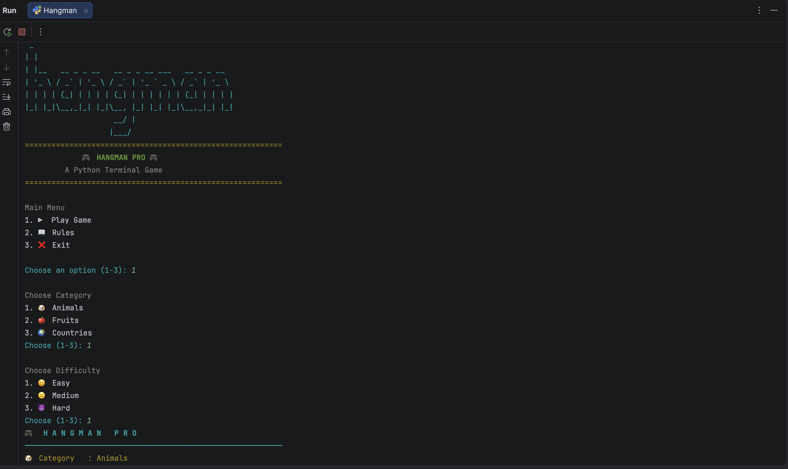
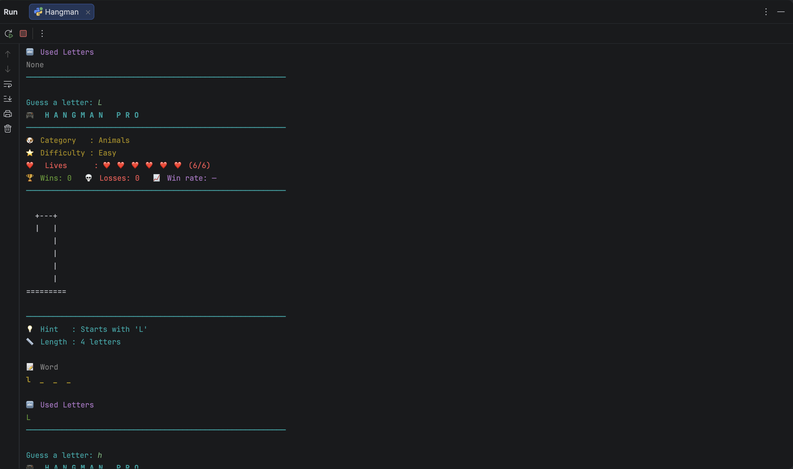
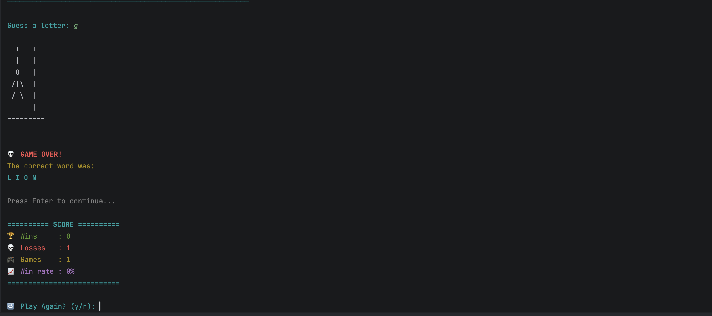

# 🎮 Hangman Pro

A feature-rich Hangman game built with Python that offers multiple categories, difficulty levels, score tracking, and an engaging terminal-based interface.

---

## ✨ Features

- 🎯 Multiple word categories
- 🔥 Three difficulty levels
- ❤️ Lives system
- 🏆 Score tracking
- 🎨 ASCII Hangman art
- 📊 Dashboard displaying:
  - Category
  - Difficulty
  - Lives Remaining
  - Current Score
- 🎲 Random word selection
- 💾 Persistent score file
- 🖥️ Clean terminal interface

---

## 📂 Project Structure

```
Hangman-pro/
│
├── Hangman.py          # Main game
├── hangman_words.py    # Word database
├── hangman_art.py      # ASCII art
├── score.txt           # Stores high score
├── Requirements.txt
├── README.md
└── .gitignore
```

---

## 🚀 Getting Started

### Clone the repository

```bash
git clone https://github.com/divyansh4321/Hangman-pro.git
```

### Go into the project

```bash
cd Hangman-pro
```

### Run the game

```bash
python Hangman.py
```

---

## 🛠 Built With

- Python 3
- Random Module
- File Handling
- Functions
- Lists
- Dictionaries
- Loops
- Conditional Statements

---

## 🎮 Gameplay

1. Choose a category.
2. Select a difficulty.
3. Guess one letter at a time.
4. Avoid running out of lives.
5. Beat your highest score!

---

## 📸 Screenshot


### Main Menu


### Gameplay


### Win Screen


Then include:

```markdown

```

---

## 📈 Future Improvements

- Multiplayer mode
- Hint system
- Sound effects
- Colored terminal output
- Leaderboard
- Save game feature
- GUI version using Tkinter or PyQt

---

## 🤝 Contributing

Contributions are welcome!

Feel free to fork the project and submit a pull request.

---

## 📄 License

This project is open-source and available under the MIT License.

---

## 👨‍💻 Author

**Divyansh**

GitHub:
https://github.com/divyansh4321